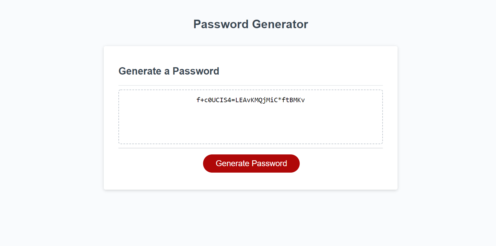

# <Password-Generator>

## Description

Building a random password generator to apply newly aquired javascript concepts. 
arrays, concatinating, for-loops, 

This project will help me generate strong unique passwords

I learned how to pull a character element out of an array and display is value instead of the index

## Installation 

No install. project is deployed

## Usage 

Generate unique password based upon user input.

